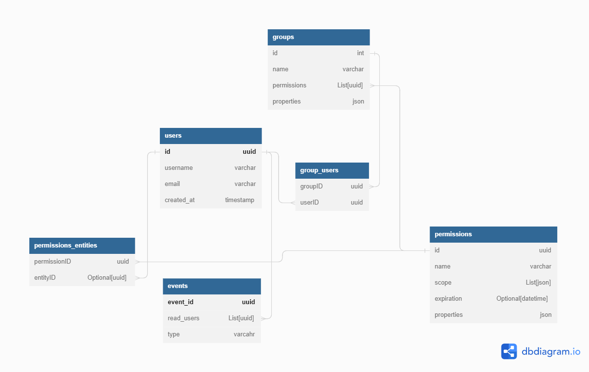

# User Management System

https://www.osohq.com/post/sqlalchemy-role-rbac-basics

# Main technology:

Two main user management options:

> ## Option 1 - [AWS Cognito](https://aws.amazon.com/cognito/)

Using Cognito will require maintaining a user table in our database but will reduce a lot of the development time on usage, authentication management, password recovery and all the things that Cognito provides right out of the box. The table that we will keep in the database will be used mainly for saving metadata about the users, and managing them in front of the groups and permissions tables.

In this configuration, there is no need to save passwords, usernames and e-mails in the database, but it is necessary to contain a record linking the ID that comes from Cognito to the ID of the user with which the other tables are accessed.

All operations to connect, disconnect and manage the user will happen using the AWS SDK or the existing lambda for user authentication.

> ## Option 2 - [FastAPI Users](https://fastapi-users.github.io/fastapi-users/10.2/)

## Authentication backend

### Transport - Cookie or Bearer

### Strategy - JWT

>**Role Based Access Control** - User has some kind of a role or associated with a group, this role/group has permission. Every permission is build with statments. each statment contain information about: 1. resource and 2. actions for this resource.

